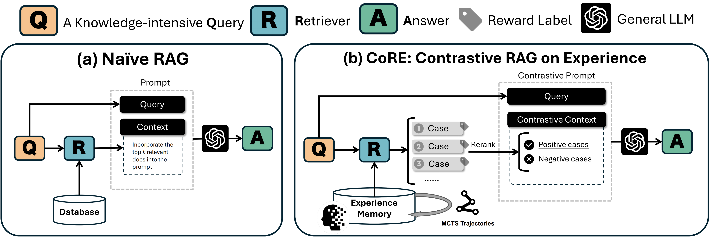

## CoRE: Contrastive Retrieval-Augmented Generation on Experience

This repository contains the official code for the paper:

**[Toward Structured Knowledge Reasoning: Contrastive Retrieval-Augmented Generation on Experience](https://arxiv.org/abs/2506.00842)**

> **CoRE** proposes a contrastive learning framework that enhances retrieval-augmented generation by aligning reasoning paths with structured experiences. 



### Coming Soon

We are currently preparing the code and documentation for release. Please stay tuned!


### 📌 Citation

```bibtex
@misc{gu2025structuredknowledgereasoningcontrastive,
      title={Toward Structured Knowledge Reasoning: Contrastive Retrieval-Augmented Generation on Experience}, 
      author={Jiawei Gu and Ziting Xian and Yuanzhen Xie and Ye Liu and Enjie Liu and Ruichao Zhong and Mochi Gao and Yunzhi Tan and Bo Hu and Zang Li},
      year={2025},
      eprint={2506.00842},
      archivePrefix={arXiv},
      primaryClass={cs.CL},
      url={https://arxiv.org/abs/2506.00842}, 
}
```

---


